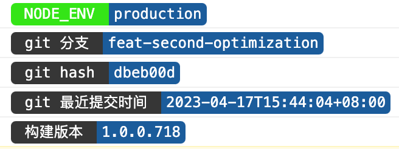

# console important message with color tags

## Usage
```typescript
import { PrettyConsoleWebpackPlugin } from '@sprit/pretty-console-webpack-plugin';
```

## configure
```typescript

new PrettyConsoleWebpackPlugin({
  git: {
    branch: true,
    hash: 7,
    lastCommitDateTime: true
  },
  custom() {
    return {
      '构建版本': process.env.BUILD_VERSION // 环境变量
    };
  }
})
```

## Output(console)

