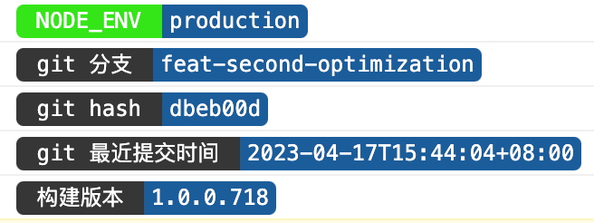

<p align="center">
  
</p>

<h1 align="center">console-tag</h1>

<p align="center">
  <strong>彩色标签 · 构建信息 · 控制台打印</strong>
</p>

<p align="center">
  <a href="https://www.npmjs.com/package/@sprit/console-tag">
    
  </a>
  <a href="https://github.com/fantian007/console-tag/actions">
    
  </a>
  <a href="./LICENSE">
    
  </a>
  
</p>

---

Webpack / Rspack 插件，在 HTML 页面控制台注入彩色标签，展示构建信息：环境、Git 分支、Commit Hash、版本、自定义字段。

## 安装

```bash
npm install @sprit/console-tag
# or
yarn add @sprit/console-tag
```

## 使用

### Rspack

```ts
import { ConsoleTagRspackPlugin } from '@sprit/console-tag';

// rspack.config.ts
plugins: [
  new HtmlRspackPlugin(),
  new ConsoleTagRspackPlugin({
    HtmlPlugin: HtmlRspackPlugin,
    git: { branch: true, hash: 7 },
  }),
]
```

### Webpack

```ts
import { ConsoleTagWebpackPlugin } from '@sprit/console-tag';

// webpack.config.ts
plugins: [
  new HtmlWebpackPlugin(),
  new ConsoleTagWebpackPlugin({
    HtmlPlugin: HtmlWebpackPlugin,
    git: { branch: true, hash: 7 },
    custom: () => ({ 构建版本: process.env.BUILD_VERSION ?? '-' }),
  }),
]
```

## 效果

打开浏览器控制台，自动打印彩色标签：

> `NODE_ENV` `production` `git 分支` `main` `git hash` `a1b2c3d`

## 配置项

| 属性 | 类型 | 默认值 | 说明 |
|------|------|--------|------|
| `NODE_ENV` | `boolean` | `true` | 显示 NODE_ENV 环境变量 |
| `git.branch` | `boolean` | `true` | Git 分支名 |
| `git.hash` | `number` | `7` | Commit hash 长度 |
| `git.version` | `boolean` | `false` | Git 版本标签 |
| `git.lastCommitDateTime` | `boolean` | `false` | 最近提交时间 |
| `custom` | `() => Record<string, string>` | — | 自定义键值对 |

## API

```ts
import {
  ConsoleTagWebpackPlugin,  // Webpack 插件
  ConsoleTagRspackPlugin,   // Rspack 插件
  Git,                      // Git 信息获取类
} from '@sprit/console-tag';
```

## License

MIT © [赵永盛](https://github.com/fantian007)
